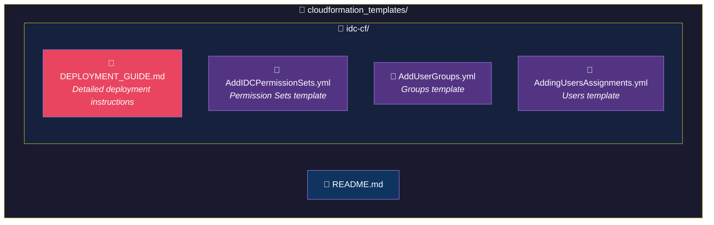

# AWS CloudFormation Templates

This repository contains AWS CloudFormation templates for managing AWS infrastructure and identity services.

---

## IAM Identity Center (IDC) Templates

The `idc-cf/` folder contains templates for deploying and managing **AWS IAM Identity Center** (formerly AWS SSO) resources:

| Template | Description |
|----------|-------------|
| `AddIDCPermissionSets.yml` | Creates Permission Sets with AWS managed policies (AdministratorAccess, PowerUserAccess, ReadOnlyAccess, etc.) |
| `AddUserGroups.yml` | Creates Identity Center Groups for organizing users |
| `AddingUsersAssignments.yml` | Creates Users and assigns them to Groups using Lambda-backed Custom Resources |

### Quick Start

1. Navigate to the `idc-cf/` folder
2. Follow the [DEPLOYMENT_GUIDE.md](idc-cf/DEPLOYMENT_GUIDE.md) for detailed instructions

### Prerequisites

- AWS IAM Identity Center enabled in your AWS Organization
- AWS CLI configured with appropriate credentials
- Identity Center Instance ARN and Identity Store ID

---

## Repository Structure

