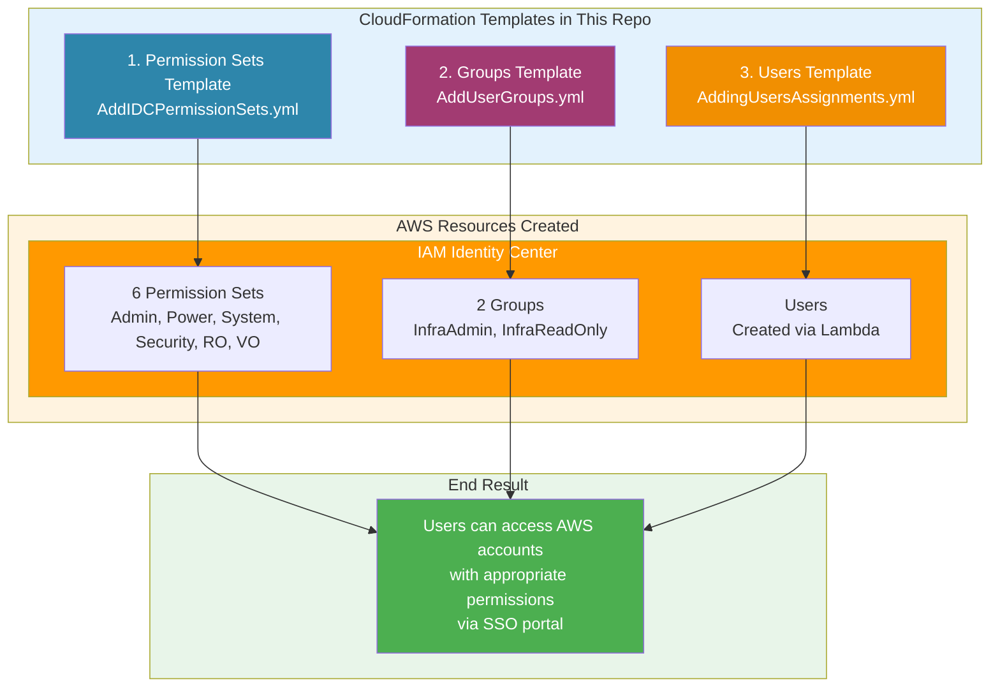
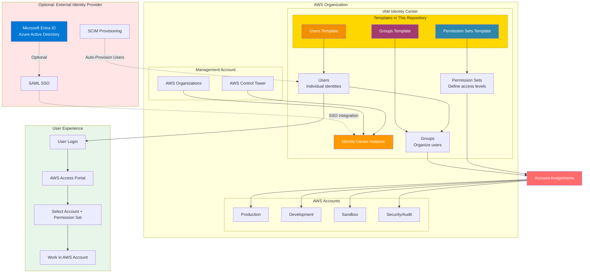
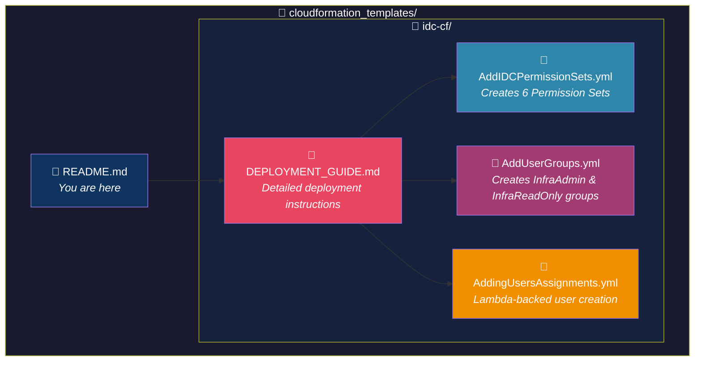
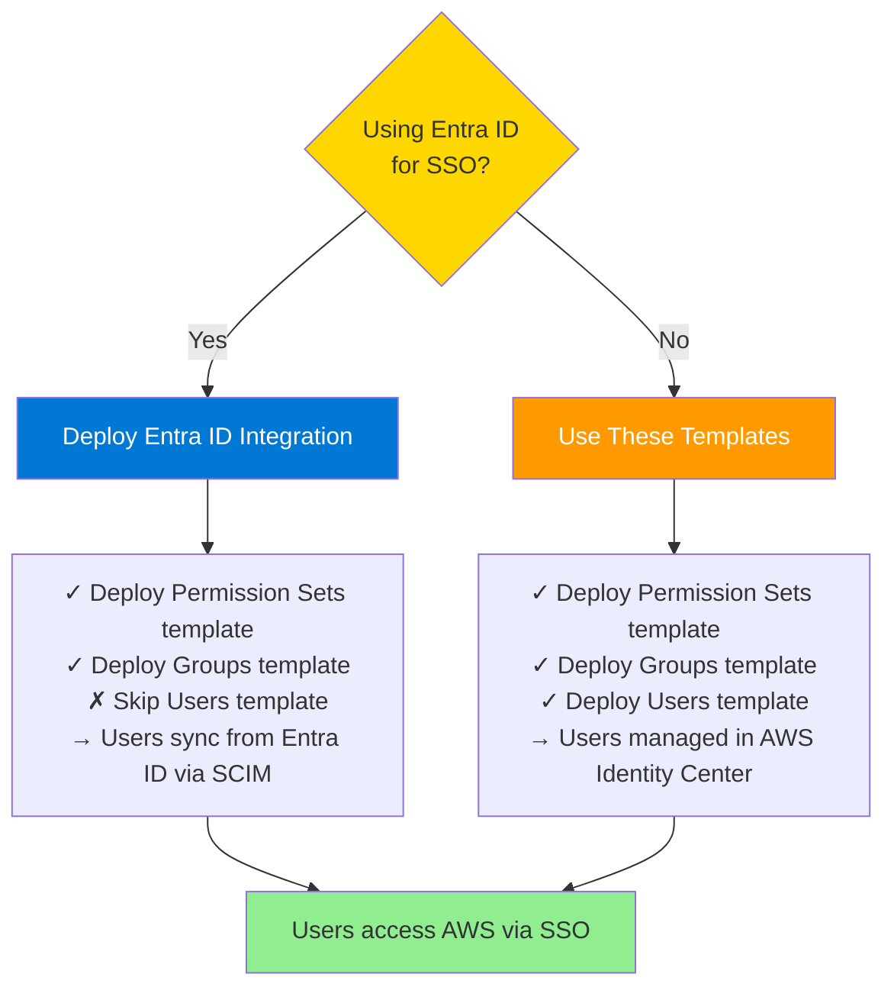
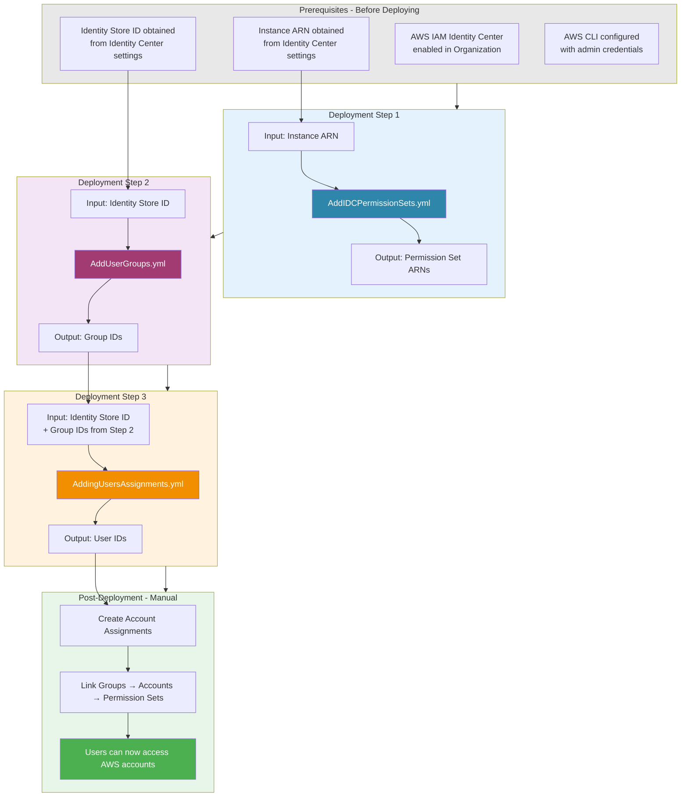

# AWS CloudFormation Templates

This repository contains AWS CloudFormation templates for managing AWS infrastructure and identity services.

---

## IAM Identity Center (IDC) Templates

The `idc-cf/` folder contains templates for deploying and managing **AWS IAM Identity Center** (formerly AWS SSO) resources:

| Template | Description |
|----------|-------------|
| `AddIDCPermissionSets.yml` | Creates Permission Sets with AWS managed policies (AdministratorAccess, PowerUserAccess, ReadOnlyAccess, etc.) |
| `AddUserGroups.yml` | Creates Identity Center Groups for organizing users |
| `AddingUsersAssignments.yml` | Creates Users and assigns them to Groups using Lambda-backed Custom Resources |

### Quick Start

1. Navigate to the `idc-cf/` folder
2. Follow the [DEPLOYMENT_GUIDE.md](idc-cf/DEPLOYMENT_GUIDE.md) for detailed instructions

### Prerequisites

- AWS IAM Identity Center enabled in your AWS Organization
- AWS CLI configured with appropriate credentials
- Identity Center Instance ARN and Identity Store ID

---

## What These Templates Do

These CloudFormation templates automate the setup of AWS IAM Identity Center, enabling centralized identity and access management across your AWS Organization.

### High-Level Architecture



---

## Deployment Flow Visualization

```mermaid
graph LR
    Start([Deploy Templates]) --> Step1[Step 1: Permission Sets]
    Step1 --> Output1[Outputs: 6 Permission Set ARNs]
    Output1 --> Step2[Step 2: Groups]
    Step2 --> Output2[Outputs: 2 Group IDs]
    Output2 --> Step3[Step 3: Users]
    Step3 --> Output3[Outputs: User IDs]
    Output3 --> Manual[Manual Step:<br/>Create Account Assignments]
    Manual --> Complete([Users Access AWS Accounts])

    style Start fill:#90EE90
    style Complete fill:#90EE90
    style Step1 fill:#2E86AB,color:#fff
    style Step2 fill:#A23B72,color:#fff
    style Step3 fill:#F18F01,color:#fff
    style Output1 fill:#E8E8E8
    style Output2 fill:#E8E8E8
    style Output3 fill:#E8E8E8
    style Manual fill:#FFD700
```



---

## Complete AWS Identity Management Architecture

This diagram shows how the templates fit into a complete AWS identity and access management setup:



---

## Repository Structure



---

## Template Details at a Glance

### 1. AddIDCPermissionSets.yml
Creates six AWS managed permission sets that define what users can do in AWS accounts:

| Permission Set | AWS Managed Policy | Use Case |
|----------------|-------------------|----------|
| AdministratorAccess | `AdministratorAccess` | Full admin rights |
| PowerUserAccess | `PowerUserAccess` | Developer access without IAM management |
| SystemAdministrator | `job-function/SystemAdministrator` | Systems/infrastructure management |
| SecurityAudit | `SecurityAudit` | Security compliance and auditing |
| ReadOnlyAccess | `ReadOnlyAccess` | View-only access to all services |
| ViewOnlyAccess | `job-function/ViewOnlyAccess` | Restricted view-only access |

### 2. AddUserGroups.yml
Creates Identity Center groups for organizing users:

| Group | Purpose |
|-------|---------|
| InfraAdmin | Infrastructure administrators with elevated privileges |
| InfraReadOnly | Read-only access for monitoring and auditing |

### 3. AddingUsersAssignments.yml
Uses Lambda-backed Custom Resources to create users and assign them to groups:

- **Why Lambda?** CloudFormation doesn't natively support creating Identity Center users
- **What it does:** Creates users, assigns to groups, handles cleanup on deletion
- **Runtime:** Python 3.11 Lambda with 120s timeout

---

## Quick Comparison: Local vs. Entra ID Integration



---

## Template Dependencies & Deployment Order

This diagram shows the dependencies between templates and the required deployment sequence:



---

## Key Features & Benefits

### Infrastructure as Code
- **Version Control**: Track all changes to your identity infrastructure
- **Reproducible**: Deploy identical setups across multiple environments
- **Automated**: No manual clicking through AWS console
- **Documented**: Templates serve as living documentation

### Lambda-Backed Custom Resources
- **Native CloudFormation**: Manage users like any other CloudFormation resource
- **Automated Cleanup**: Users are deleted when stack is deleted
- **Error Handling**: Built-in retry logic and error reporting
- **Extensible**: Easy to modify for additional user attributes

### Best Practices Built-In
- **Least Privilege**: Permission sets use AWS managed policies
- **Organized Access**: Group-based permission assignments
- **Session Duration**: Configurable session timeouts
- **Cross-Stack References**: Outputs enable modular deployments

---

## Common Use Cases

### 1. New AWS Organization Setup
```
Deploy all three templates → Create account assignments → Onboard team
```

### 2. Adding New Permission Levels
```
Edit AddIDCPermissionSets.yml → Add new permission set → Redeploy stack
```

### 3. Onboarding New Team Members
```
Edit AddingUsersAssignments.yml → Add user parameters → Update stack
```

### 4. Migrating to Entra ID
```
Setup SAML/SCIM → Deploy Permission Sets & Groups → Skip Users template
```

---

## Related Resources

- **[Detailed Deployment Guide](idc-cf/DEPLOYMENT_GUIDE.md)** - Step-by-step instructions with examples
- **[AWS IAM Identity Center Documentation](https://docs.aws.amazon.com/singlesignon/)** - Official AWS documentation
- **[AWS Control Tower Setup](https://github.com/damatechguy27/cloudformation_templates/wiki/Aws-control-tower-setup-guide)** - Landing Zone setup guide
- **[Entra ID Integration Guide](https://github.com/damatechguy27/cloudformation_templates/wiki/Integrating-Entra-ID-with-AWS-Identity-Center)** - SSO configuration

---

## Getting Help

If you encounter issues:

1. Check the [DEPLOYMENT_GUIDE.md](idc-cf/DEPLOYMENT_GUIDE.md) troubleshooting section
2. Review CloudWatch Logs for Lambda function errors (Users template)
3. Verify Instance ARN and Identity Store ID formats
4. Ensure IAM Identity Center is enabled in your Organization
