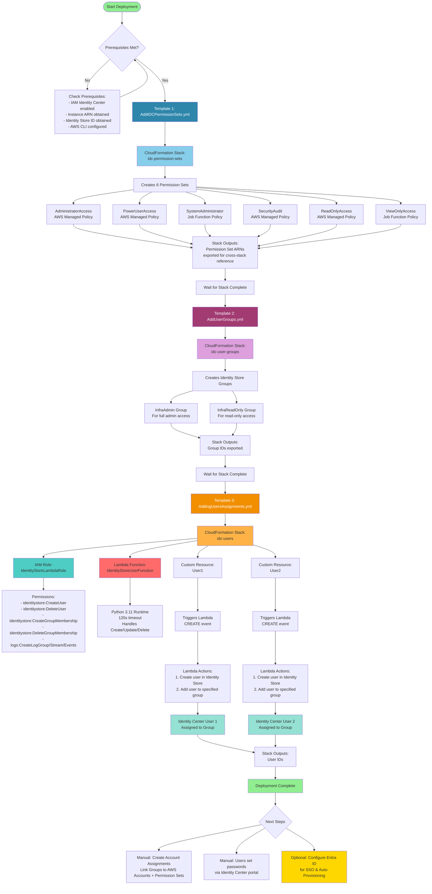
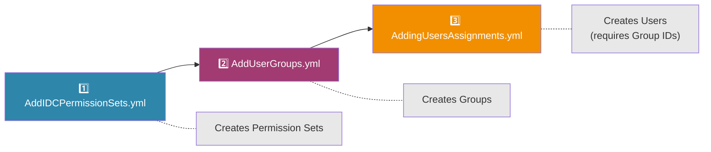
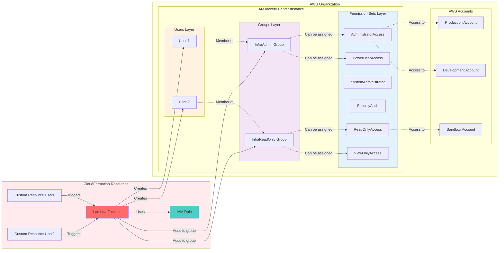
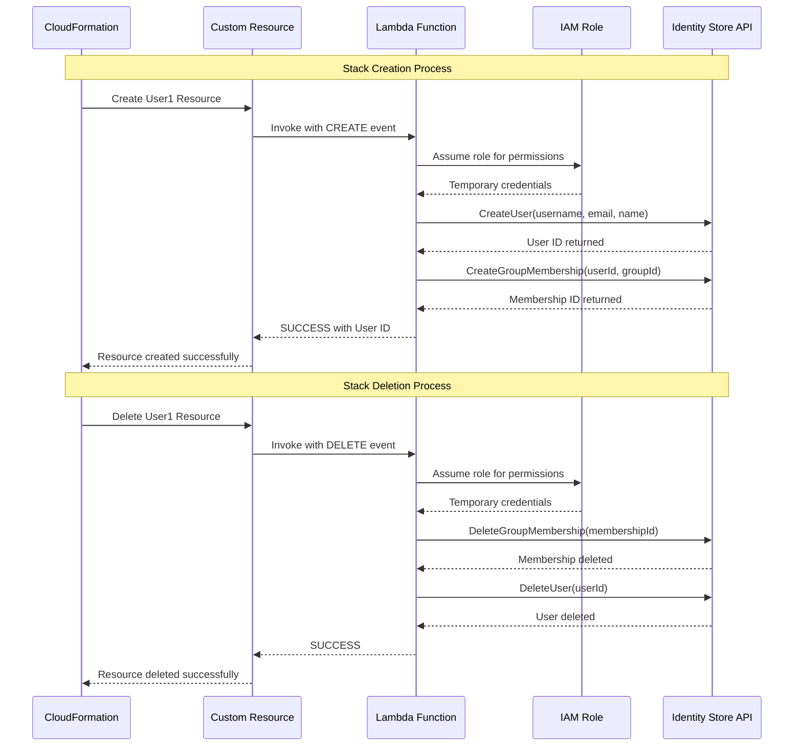
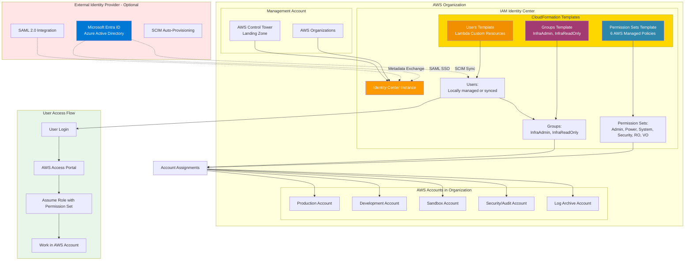
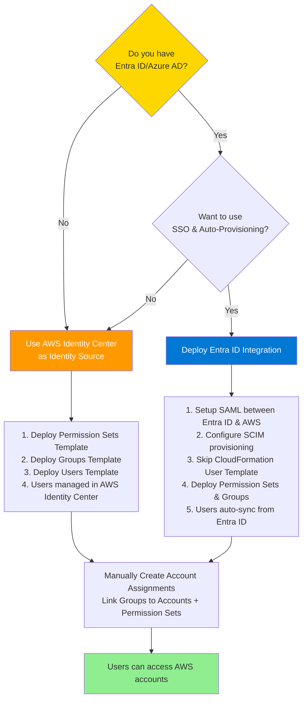

# AWS IAM Identity Center CloudFormation Templates

This folder contains CloudFormation templates for managing AWS IAM Identity Center (formerly AWS SSO) resources including Permission Sets, Groups, and Users.

---

## Prerequisites

Before deploying these templates, ensure you have:

1. **AWS IAM Identity Center enabled** in your AWS Organization
2. **AWS CLI configured** with appropriate credentials
3. **Required information:**
   - **Instance ARN**: Found in IAM Identity Center → Settings → Identity source (format: `arn:aws:sso:::instance/ssoins-xxxxxxxxxxxxxxxx`)
   - **Identity Store ID**: Found in IAM Identity Center → Settings (format: `d-xxxxxxxxxx`)

---

## Templates Overview

| Template | Purpose | Dependencies |
|----------|---------|--------------|
| `AddIDCPermissionSets.yml` | Creates Permission Sets | None |
| `AddUserGroups.yml` | Creates Identity Center Groups | None |
| `AddingUsersAssignments.yml` | Creates Users and assigns to Groups | Groups must exist |

---

## 1. AddIDCPermissionSets.yml

### Description

This template creates **six standard Permission Sets** in IAM Identity Center. Permission Sets define the level of access users and groups have when they access AWS accounts.

### Permission Sets Created

| Permission Set | AWS Managed Policy | Description |
|----------------|-------------------|-------------|
| **AdministratorAccess** | `AdministratorAccess` | Full access to all AWS services and resources |
| **PowerUserAccess** | `PowerUserAccess` | Full access except IAM and Organizations management |
| **SystemAdministrator** | `job-function/SystemAdministrator` | Systems management and administration tasks |
| **SecurityAudit** | `SecurityAudit` | Security auditing and compliance review access |
| **ReadOnlyAccess** | `ReadOnlyAccess` | Read-only access to all AWS services |
| **ViewOnlyAccess** | `job-function/ViewOnlyAccess` | More restricted view-only access |

### Parameters

| Parameter | Type | Description | Default |
|-----------|------|-------------|---------|
| `InstanceArn` | String | ARN of the IAM Identity Center instance | Required |
| `SessionDurationHours` | Number | Session duration (1-12 hours) | 8 |

### Deployment Command

```bash
aws cloudformation create-stack \
  --stack-name idc-permission-sets \
  --template-body file://AddIDCPermissionSets.yml \
  --parameters \
    ParameterKey=InstanceArn,ParameterValue=arn:aws:sso:::instance/ssoins-xxxxxxxxxxxxxxxx \
    ParameterKey=SessionDurationHours,ParameterValue=8
```

### Outputs

The template exports ARNs for all Permission Sets, which can be used in other stacks for account assignments:
- `{StackName}-AdministratorAccessPermissionSetArn`
- `{StackName}-PowerUserAccessPermissionSetArn`
- `{StackName}-SystemAdministratorPermissionSetArn`
- `{StackName}-SecurityAuditPermissionSetArn`
- `{StackName}-ReadOnlyAccessPermissionSetArn`
- `{StackName}-ViewOnlyAccessPermissionSetArn`

---

## 2. AddUserGroups.yml

### Description

This template creates **Identity Center Groups** that can be used to organize users and assign permissions collectively.

### Groups Created

| Group Name | Description |
|------------|-------------|
| **InfraAdmin** | Infrastructure administrators with full AWS access |
| **InfraReadOnly** | Infrastructure read-only access |

### Parameters

| Parameter | Type | Description |
|-----------|------|-------------|
| `IdentityStoreId` | String | The ID of the Identity Store (format: `d-xxxxxxxxxx`) |

### Deployment Command

```bash
aws cloudformation create-stack \
  --stack-name idc-user-groups \
  --template-body file://AddUserGroups.yml \
  --parameters \
    ParameterKey=IdentityStoreId,ParameterValue=d-xxxxxxxxxx
```

### Outputs

The template exports Group IDs for use in user assignments:
- `{StackName}-InfraAdminGroupId`
- `{StackName}-InfraReadOnlyGroupId`

---

## 3. AddingUsersAssignments.yml

### Description

This template creates **IAM Identity Center Users** and assigns them to groups using a **Lambda-backed Custom Resource**. This approach is necessary because CloudFormation doesn't natively support `AWS::IdentityStore::User` resources.

### How It Works

1. **Lambda Function**: Creates a Python Lambda function that interacts with the Identity Store API
2. **IAM Role**: Grants the Lambda function permissions to manage users and group memberships
3. **Custom Resources**: Uses CloudFormation Custom Resources to trigger the Lambda for user creation

### Resources Created

- **IAM Role** (`IdentityStoreLambdaRole`): Permissions for Lambda to manage Identity Store
- **Lambda Function** (`IdentityStoreUserFunction`): Handles Create, Update, and Delete operations
- **User 1** (`User1`): First user with group assignment
- **User 2** (`User2`): Second user with group assignment

### Lambda Function Capabilities

| Operation | Actions Performed |
|-----------|-------------------|
| **Create** | Creates user in Identity Store, adds to specified group |
| **Update** | Returns success (no modifications) |
| **Delete** | Removes group membership, deletes user |

### Parameters

| Parameter | Type | Description |
|-----------|------|-------------|
| `IdentityStoreId` | String | Identity Store ID (format: `d-xxxxxxxxxx`) |
| `User1UserName` | String | Username for User 1 |
| `User1FirstName` | String | First name for User 1 |
| `User1LastName` | String | Last name for User 1 |
| `User1Email` | String | Email for User 1 |
| `User1GroupId` | String | Group ID to assign User 1 |
| `User2UserName` | String | Username for User 2 |
| `User2FirstName` | String | First name for User 2 |
| `User2LastName` | String | Last name for User 2 |
| `User2Email` | String | Email for User 2 |
| `User2GroupId` | String | Group ID to assign User 2 |

### Deployment Command

```bash
aws cloudformation create-stack \
  --stack-name idc-users \
  --template-body file://AddingUsersAssignments.yml \
  --capabilities CAPABILITY_NAMED_IAM \
  --parameters \
    ParameterKey=IdentityStoreId,ParameterValue=d-xxxxxxxxxx \
    ParameterKey=User1UserName,ParameterValue=jdoe \
    ParameterKey=User1FirstName,ParameterValue=John \
    ParameterKey=User1LastName,ParameterValue=Doe \
    ParameterKey=User1Email,ParameterValue=jdoe@example.com \
    ParameterKey=User1GroupId,ParameterValue=<InfraAdminGroupId> \
    ParameterKey=User2UserName,ParameterValue=jsmith \
    ParameterKey=User2FirstName,ParameterValue=Jane \
    ParameterKey=User2LastName,ParameterValue=Smith \
    ParameterKey=User2Email,ParameterValue=jsmith@example.com \
    ParameterKey=User2GroupId,ParameterValue=<InfraReadOnlyGroupId>
```

> **Note**: `--capabilities CAPABILITY_NAMED_IAM` is required because this template creates an IAM role.

### Outputs

- `User1Id`: The Identity Store User ID for User 1
- `User2Id`: The Identity Store User ID for User 2

---

## Deployment Architecture & Flow

This section provides a comprehensive view of the deployment process, showing how CloudFormation templates create AWS resources and their relationships.

### Complete Deployment Architecture



### Quick Deployment Order (Simple View)



### Resource Relationship Diagram

This diagram shows how AWS resources created by the templates relate to each other:



### Understanding the Lambda Custom Resource Flow

Since CloudFormation doesn't natively support `AWS::IdentityStore::User`, we use a Lambda-backed Custom Resource pattern:



### Integration with Broader AWS Environment

This diagram shows how the CloudFormation-deployed resources fit into a complete AWS identity management architecture:



### Deployment Decision Tree

Use this flowchart to determine your deployment approach:



---

## Deployment Order Summary

| Step | Template | Creates | Depends On | Export/Output |
|------|----------|---------|------------|---------------|
| 1️⃣ | `AddIDCPermissionSets.yml` | 6 Permission Sets | IAM Identity Center enabled | Permission Set ARNs |
| 2️⃣ | `AddUserGroups.yml` | 2 Groups (InfraAdmin, InfraReadOnly) | Step 1 complete | Group IDs |
| 3️⃣ | `AddingUsersAssignments.yml` | Lambda function, IAM role, 2 Users | Step 2 complete (needs Group IDs) | User IDs |
| 4️⃣ | Manual | Account Assignments | Steps 1-3 complete | Users can access accounts |

### Complete Deployment Script

```bash
# Set your variables
INSTANCE_ARN="arn:aws:sso:::instance/ssoins-xxxxxxxxxxxxxxxx"
IDENTITY_STORE_ID="d-xxxxxxxxxx"

# Step 1: Deploy Permission Sets
aws cloudformation create-stack \
  --stack-name idc-permission-sets \
  --template-body file://AddIDCPermissionSets.yml \
  --parameters ParameterKey=InstanceArn,ParameterValue=$INSTANCE_ARN

aws cloudformation wait stack-create-complete --stack-name idc-permission-sets

# Step 2: Deploy Groups
aws cloudformation create-stack \
  --stack-name idc-user-groups \
  --template-body file://AddUserGroups.yml \
  --parameters ParameterKey=IdentityStoreId,ParameterValue=$IDENTITY_STORE_ID

aws cloudformation wait stack-create-complete --stack-name idc-user-groups

# Get Group IDs from outputs
INFRA_ADMIN_GROUP_ID=$(aws cloudformation describe-stacks \
  --stack-name idc-user-groups \
  --query "Stacks[0].Outputs[?OutputKey=='InfraAdminGroupId'].OutputValue" \
  --output text)

INFRA_READONLY_GROUP_ID=$(aws cloudformation describe-stacks \
  --stack-name idc-user-groups \
  --query "Stacks[0].Outputs[?OutputKey=='InfraReadOnlyGroupId'].OutputValue" \
  --output text)

# Step 3: Deploy Users
aws cloudformation create-stack \
  --stack-name idc-users \
  --template-body file://AddingUsersAssignments.yml \
  --capabilities CAPABILITY_NAMED_IAM \
  --parameters \
    ParameterKey=IdentityStoreId,ParameterValue=$IDENTITY_STORE_ID \
    ParameterKey=User1UserName,ParameterValue=admin1 \
    ParameterKey=User1FirstName,ParameterValue=Admin \
    ParameterKey=User1LastName,ParameterValue=User \
    ParameterKey=User1Email,ParameterValue=admin1@example.com \
    ParameterKey=User1GroupId,ParameterValue=$INFRA_ADMIN_GROUP_ID \
    ParameterKey=User2UserName,ParameterValue=readonly1 \
    ParameterKey=User2FirstName,ParameterValue=ReadOnly \
    ParameterKey=User2LastName,ParameterValue=User \
    ParameterKey=User2Email,ParameterValue=readonly1@example.com \
    ParameterKey=User2GroupId,ParameterValue=$INFRA_READONLY_GROUP_ID

aws cloudformation wait stack-create-complete --stack-name idc-users
```

---

## Cleanup

To delete all resources, remove stacks in reverse order:

```bash
aws cloudformation delete-stack --stack-name idc-users
aws cloudformation wait stack-delete-complete --stack-name idc-users

aws cloudformation delete-stack --stack-name idc-user-groups
aws cloudformation wait stack-delete-complete --stack-name idc-user-groups

aws cloudformation delete-stack --stack-name idc-permission-sets
aws cloudformation wait stack-delete-complete --stack-name idc-permission-sets
```

---

## Troubleshooting

| Issue | Solution |
|-------|----------|
| `Invalid InstanceArn` | Verify format: `arn:aws:sso:::instance/ssoins-xxxxxxxxxxxxxxxx` |
| `Invalid IdentityStoreId` | Verify format: `d-xxxxxxxxxx` |
| User creation fails | Check Lambda logs in CloudWatch for detailed errors |
| Permission denied | Ensure your AWS credentials have IAM Identity Center admin access |
| Stack stuck in `CREATE_IN_PROGRESS` | Check Lambda function logs for Custom Resource timeout |

---

## Additional Notes

- Users created via CloudFormation will need to set up their passwords through the IAM Identity Center portal
- To assign groups to AWS accounts with permission sets, you'll need to create additional `AWS::SSO::Assignment` resources
- The Lambda function runtime is Python 3.11 with a 120-second timeout
